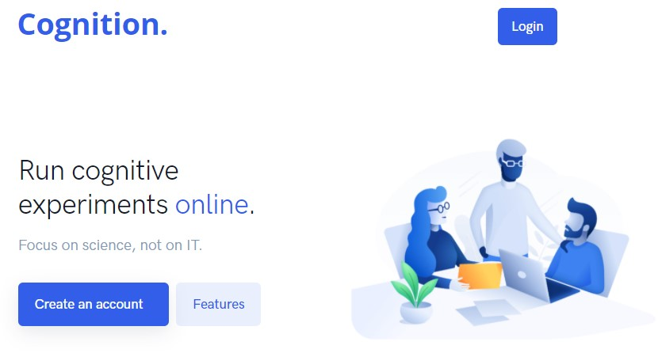
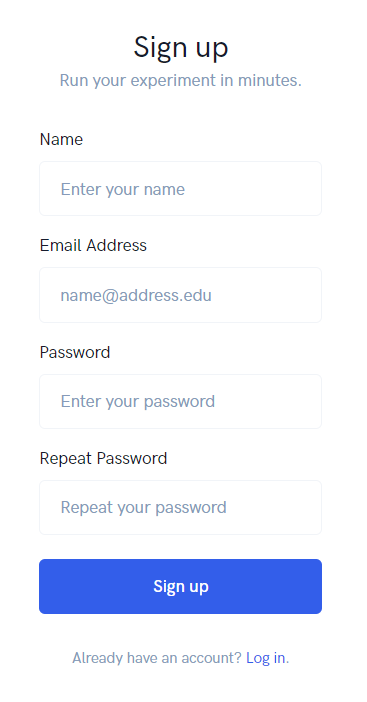
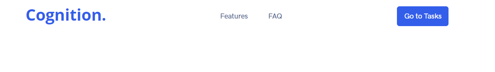
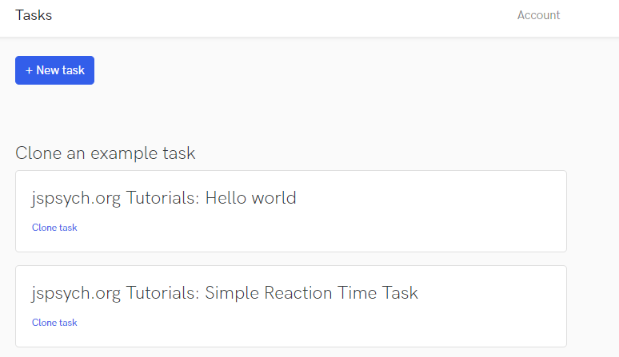
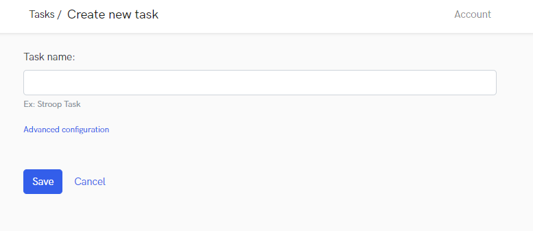
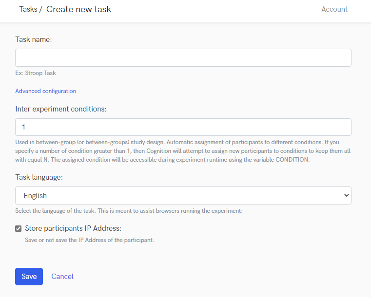
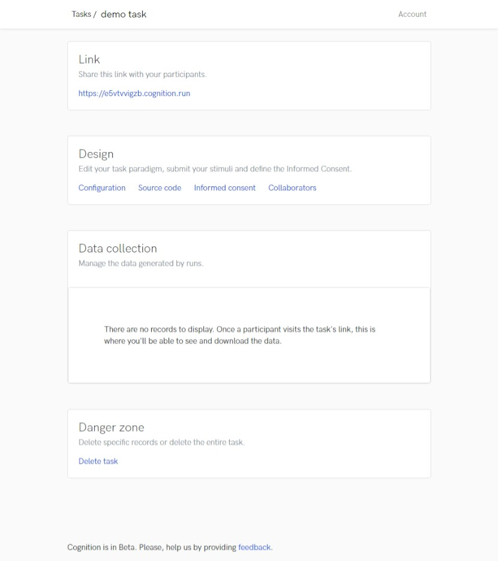

# Getting around cognition.run website.

The purpose of this website is to allow users to create and run experiments without the hassle of learning to set-up a server for their jsPsych experiments. 

## Step-by-step instructions

### 1. Go to [cognition.run website](https://www.cognition.run)
  

### 2. Create an account on the website (free).
  
 

### 3. Login and go to your tasks. 
_If you are not redirected, go to the [cognition.run website](https://www.cognition.run) and find the icon go to tasks on the top right._   
  
 

### 4. Now you are in the back-end.
---  
  
Here is where you can manage all of your experiments, and where you have a couple of examples to play around with. 
  
 

### 5. Create a new Task clicking the relevant button. 
In this form, please provide a name for your task, and save. 
  
 
  
  
_**Advanced settings** are not needed unless some specific parameters are needed in your experiment._
  
 
  
   
   
### 6. When you click on save, you are redirected in the _control panel_ of the specific task.

_Here you can find_ 
+ the public link to the experiment, that you can share with your participants. 
+ the Design options where you can modify the task 
+ and the data collection where all the results will be registered
+ finally, an option to delete the task
  
  

  
  
### 7. Examine the Design block. 
  
_Here you have_ 
+ Configuration (where you have the name of the experiment and the advanced settings) 
+ The source code where all the code will be added. 
+ Informed concent (in case you need it for your experiments)
+ and collaborators, if you want to share access to the experiment with someone else from your team (using their own account). 
  
  
  
### 8. Click on the source code and you are in front of the main panel to design your task.
  
   

#### 
  
  
On the **left** you will have to choose the version of jsPsych library _(if you are unsure, you can leave the default option)_, [add the necessary files](#files) and the [stimuli](#) (in our case, the images you want). 

In the **middle** *(black box)* you will paste the code that you have produced from the [constructor](../constructor/constructor) or you will be able to write your own code (if you know how to code in jsPsych). 

On the **right** panel you will be able to test your experiment in demo mode. If you *don't* want to see this, you can click on disable preview.  
  
### 9. Create your own experiment.  

a. You can leave the jsPsych library version as is: 6.3.1 
b. Download and add the following files on the left under **External JS, CSS**. These files will allow cognition to recognise the Q-methodology trial for you to use it.
  
  <pre>

  The files you should have (at minimum) are: 
   [jquery-3.6.0.min.js](../source/jquery-3.6.0.min.js)
   [jspsych-grid.css](../source/jspsych-grid.css)
   [jspsych-draggable.js](../source/jspsych-draggable.js)
   [jspsych-grid.js](../source/jspsych-grid.js)
   <a href="../source/jspsych-grid.js">jspsych-grid.js</a>
   

  </pre>

c. Under stimuli, you will upload the images that you want to use for your experiment. Please make sure you respect the image dimensions
  
  
### 10. Test the experiment
  
You can test the experiment on the right hand side and if you are satisfied you can test also the public version by accessing the Task's control panel. 

To access it easily, just click on the name of the experiment on the top of the page 
(Tasks / [experiment_name](#) / Edit)

### 11. Collect answers. 
  
  If you go back to your experiment's control panel, under Data Collection, you will be able to see all the users who run your experiment. You will be given the option to download a complete csv file, or to see individual runs of the experiment.

**N.B.** cognition.run at the moment provides a unmodifiable data structure. You will need to post-process the data to extract the information you need. 
  
  
  
---
[Back to the homepage](/Q-methodology/)
